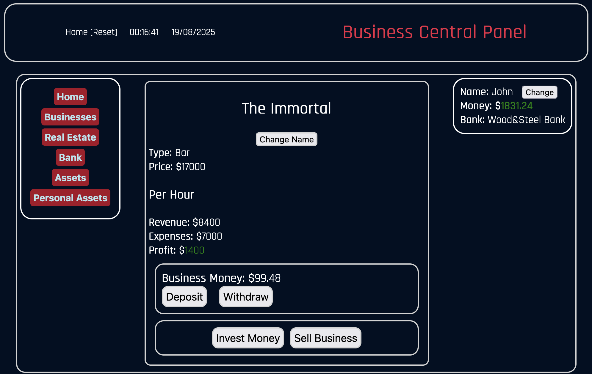

# Business Central Panel
A game simulating a central panel to manage your businesses.

It is playable in a browser with a web server.
The business buying/selling systems are not scalable, and only one business (The Immortal Bar) is available for purchase.

I made this project to learn the fundamentals of javascript.



## How to download
On MacOS and Linux :
```bash
git clone https://github.com/hedi0410/business_central_panel.git
```

## License

This project is licensed under the MIT License. See the [LICENSE](./LICENSE) file for details.
